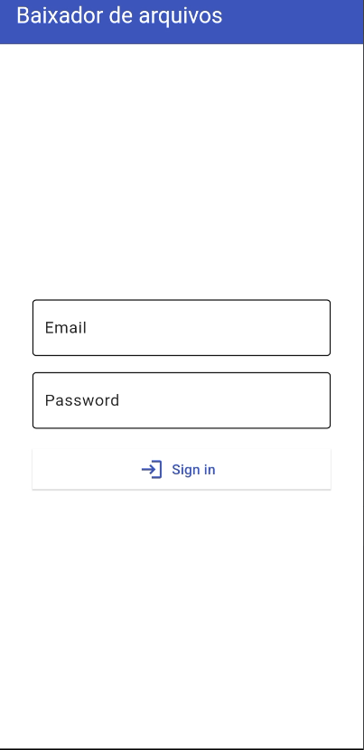
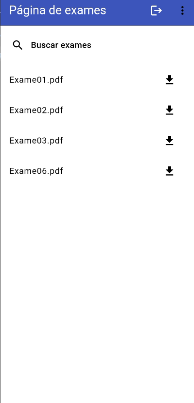

# Baixador_de_arquivos

 Sistema para baixar arquivos PDF usando Flutter e Appwrite com login de usuário para dispositivos android

 ## Bibliotecas
 
 Dependências do arquivo pubspec.yaml para conhecer as bibliotecas

 * [Appwrite](https://pub.dev/packages/appwrite)
 * [Path provider](https://pub.dev/packages/path_provider)
 * [Provider](https://pub.dev/packages/provider)

## Como executar
 
* Instalar o [flutter SDK](https://docs.flutter.dev/)  
* Instalar uma Ferramenta de desenvolvimento (Visual Studio ou Android Studio)  
* Criar um servidor usando [Appwrite](https://appwrite.io/docs/advanced/self-hosting) e [Docker](https://www.docker.com/)  
* Criar um [projeto](https://appwrite.io/docs/quick-starts/flutter) dentro do Appwrite e criar os usuários e arquivos, dando as permissões de leitura de um arquivo para no máximo um usuário  
* Definir os IDs do projeto, da Url do servidor(no caso de self hosting será o IP), do banco de dados e do Bucket com os arquivos no arquivo constantes.dart
* Alterar o AndroidManifest.xml como mostrado no site do Appwrite para usar o ID do seu projeto
* Para self hosting e for usado um dispositvo android fisico, tanto o aparelho quanto o servidor precisam estar na mesma rede

## Screenshots




## Funções principais


 Faz a conexão com o servidor
```dart
init() {
    cliente
        .setEndpoint(APPWRITE_URL)
        .setProject(APPWRITE_ID)
        .setSelfSigned(status: true);
    conta = Account(cliente);
    storage = Storage(cliente);
}
```
Recebe o email e senha do usuário para verificar se são informações válidas
```dart
Future<Session> criarSessaoEmail(
      {required String email, required String password}) async {
    try {
      final session =
      await conta.createEmailPasswordSession(email: email, password: password);
      _currentUser = await conta.get();
      _status = AuthStatus.authenticated;
      return session;
    } finally {
      notifyListeners();
    }
  }
```
Recebe as informações do arquivo(nome e local) e o baixa na pasta de download
```dart
Future<void> downloadArquivo(String bucketId, String fileId) async {
    final exameInfo = await storage.getFile(
      bucketId: bucketId,
      fileId: fileId,
    );
    final exame = await storage.getFileDownload(
      bucketId: bucketId,
      fileId: fileId,
    );
      final dart_io.Directory? downloadsDir = await getDownloadsDirectory();
      if (downloadsDir != null) {
        String filePath = '${downloadsDir.path}/${exameInfo.name}';
        final file = dart_io.File(filePath);

        file.writeAsBytesSync(exame);
        print('Arquivo baixado com sucesso em $filePath');

      } else {
        print('Não foi possível acessar o diretório de downloads');
      }
  }
```
